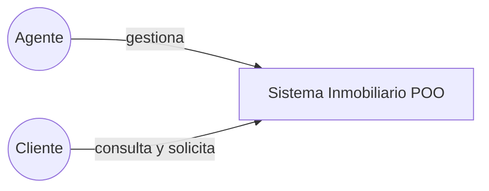

# Casos de uso

## Actores

| Actor | Descripción |
|---|---|
| **Agente** | Empleado de la inmobiliaria; gestiona inventario y atiende solicitudes |
| **Cliente** | Comprador o posible inquilino; consulta y solicita |
| **Sistema** | Validaciones, persistencia SQLite y cálculo de reglas |

## Diagrama de casos de uso (visión general)

```mermaid
flowchart TB
  subgraph PortalCliente[Portal Cliente]
    UC1[UC01 Completar perfil]
    UC2[UC02 Buscar viviendas]
    UC3[UC03 Ver detalle]
    UC4[UC04 Solicitar visita]
    UC5[UC05 Interés compra]
    UC6[UC06 Interés alquiler]
    UC7[UC07 Comprobar regla 35%]
  end

  subgraph Backoffice[Backoffice Agente]
    UC8[UC08 Alta vivienda]
    UC9[UC09 Reservar / Liberar]
    UC10[UC10 Registrar venta]
    UC11[UC11 Registrar alquiler]
    UC12[UC12 Decorar / Reformar]
    UC13[UC13 Ver informe]
    UC14[UC14 Gestionar solicitudes]
  end

  Cliente((Cliente)) --> UC1 & UC2 & UC3 & UC4 & UC5 & UC6 & UC7
  Agente((Agente)) --> UC8 & UC9 & UC10 & UC11 & UC12 & UC13 & UC14
```

---

## Casos de uso — Cliente

### UC01 · Completar perfil
- **Precondición:** Usuario en portal Cliente.
- **Flujo:** Introduce nombre, DNI, teléfono e ingresos → Guardar perfil.
- **Postcondición:** Sesión de cliente válida en memoria (y cliente persistible al solicitar).
- **Errores:** Campos vacíos, DNI inválido, ingresos no numéricos.

### UC02 · Buscar viviendas disponibles
- **Flujo:** Opcionalmente filtra por localidad y rango de precio → Buscar disponibles.
- **Postcondición:** Tabla con casas en estado `DISPONIBLE`.

### UC03 · Ver detalle
- **Precondición:** Fila seleccionada.
- **Flujo:** Ver detalle → mensaje con precio/m², estado y rentabilidad estimada.

### UC04 · Solicitar visita
- **Precondición:** Perfil completo + vivienda disponible seleccionada.
- **Flujo:** Solicitar visita → mensaje opcional → se crea solicitud `VISITA` / `PENDIENTE`.
- **Postcondición:** Visible en bandeja del agente.

### UC05 / UC06 · Interés compra o alquiler
Igual que UC04 con tipos `COMPRA` o `ALQUILER`.

### UC07 · Comprobar regla del 35 %
- **Flujo:** Indica renta mensual deseada.
- **Resultado:** Si `renta <= ingresos * 0.35` → elegible; si no → aviso con tope.

---

## Casos de uso — Agente

### UC08 · Alta de vivienda
- **Flujo:** Nueva vivienda → formulario (dirección, CP, localidad, m², precio, hab.) → Guardar.
- **Postcondición:** Insertada en SQLite y visible en tabla.

### UC09 · Reservar / Liberar
- **Reservar:** solo desde `DISPONIBLE`.
- **Liberar:** desde `RESERVADA` o `ALQUILADA` (limpia contrato).

### UC10 · Registrar venta (`comprar`)
- **Estados admitidos:** `DISPONIBLE` o `RESERVADA`.
- **Efecto:** precio final = precio × (1 + AITP); estado `VENDIDA`.

### UC11 · Registrar alquiler
- **Flujo:** Datos del inquilino + renta + fianza.
- **Regla:** el inquilino debe superar la regla del 35 %.
- **Efecto:** contrato persistido; estado `ALQUILADA`.

### UC12 · Decorar / Reformar
- **Decorar:** suma coste al precio (no vende).
- **Reformar:** suma coste × (1 + IVA); estado `EN_REFORMA`.
- **Finalizar reforma:** vuelve a `DISPONIBLE`.

### UC13 · Informe de cartera
Muestra número de propiedades, valor total, desglose por estado y detalle.

### UC14 · Gestionar solicitudes
Lista solicitudes; puede marcar la primera pendiente como `ATENDIDA`.

---

## Reglas de negocio transversales

| ID | Regla |
|---|---|
| RN01 | CP español válido (01000–52999) |
| RN02 | Precio, m² y rentas > 0 |
| RN03 | AITP por defecto 10 % (configurable) |
| RN04 | IVA reforma 21 % |
| RN05 | Renta ≤ 35 % de ingresos del inquilino |
| RN06 | Transiciones de estado controladas por métodos de `Casa` |
| RN07 | Cliente solo opera sobre viviendas `DISPONIBLE` |
| RN08 | Toda operación de agente relevante se sincroniza a SQLite |

## Matriz actor × capacidad

| Capacidad | Agente | Cliente |
|---|---|---|
| Ver no disponibles | Sí | No |
| Alta / venta / reforma | Sí | No |
| Solicitar visita | No | Sí |
| Ver DNI de terceros | En solicitudes | Solo el suyo |
| Informe de cartera | Sí | No |
| Regla 35 % (autoevaluación) | En alquiler | Botón dedicado |
