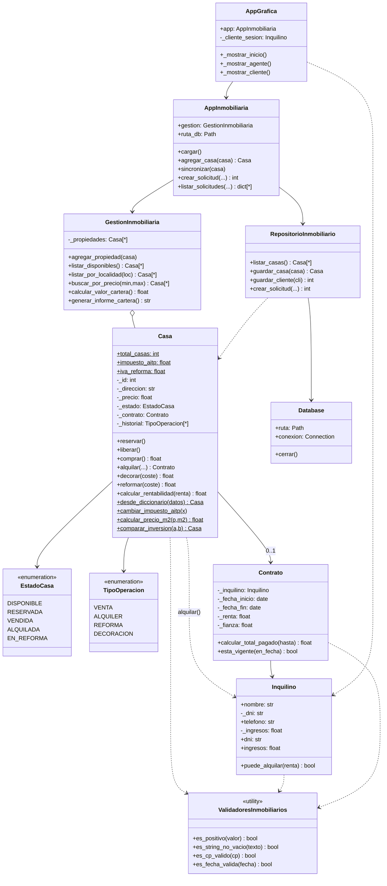
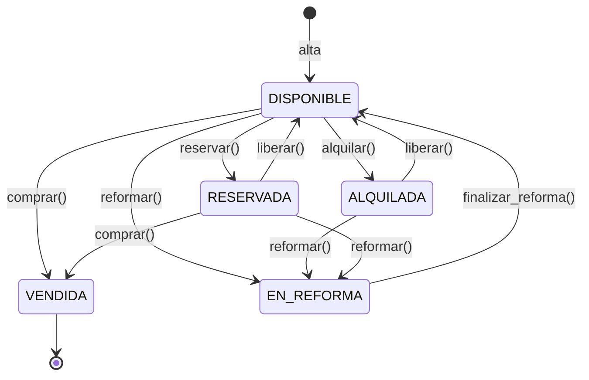
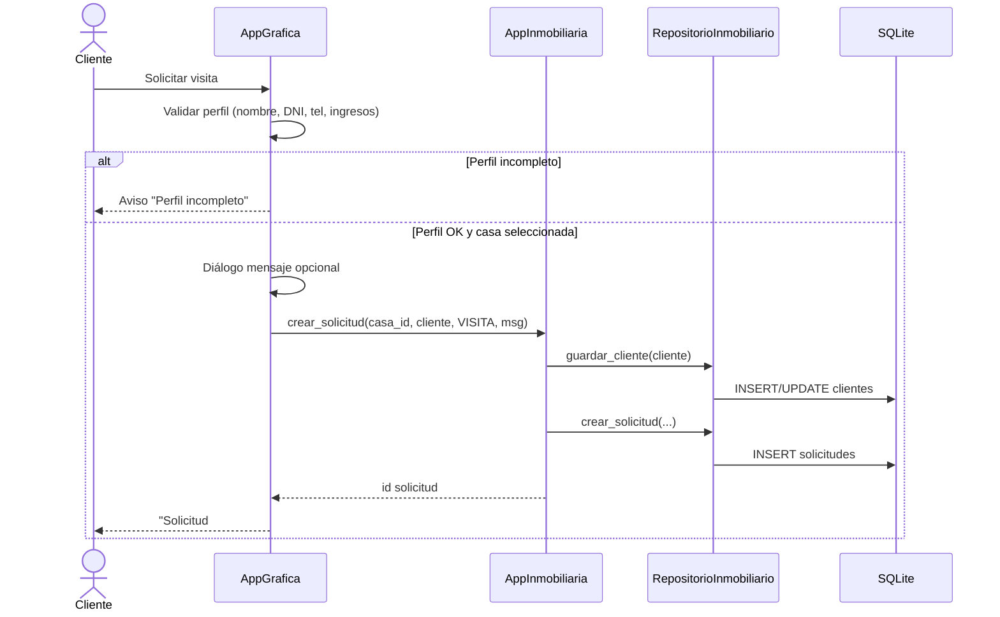
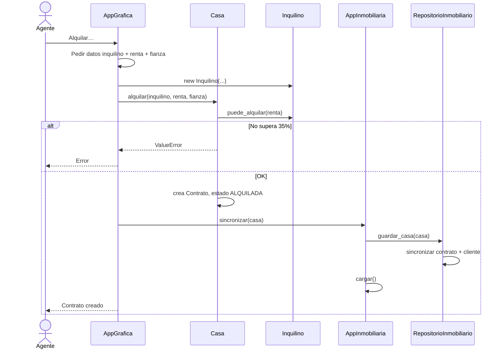
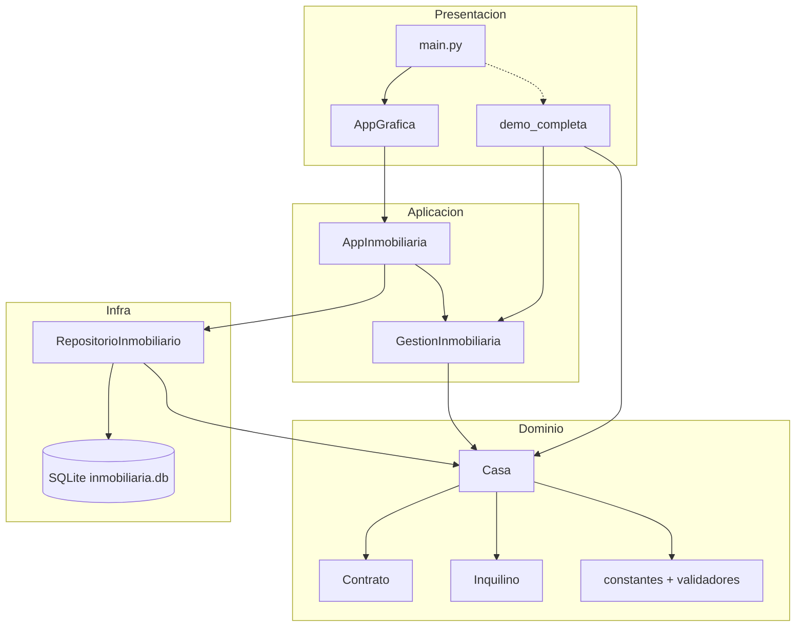
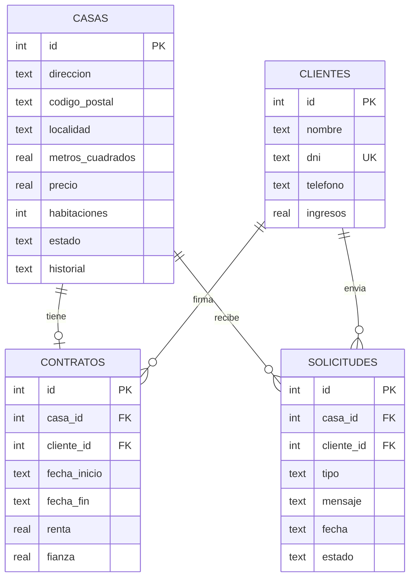
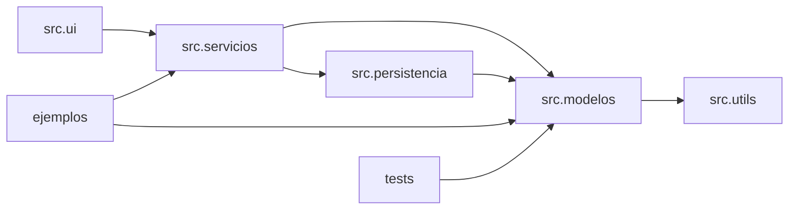

# Diagramas UML

Los diagramas usan [Mermaid](https://mermaid.js.org/). Se visualizan en GitHub, VS Code/Cursor (vista previa Markdown) o [mermaid.live](https://mermaid.live).

---

## 1. Diagrama de clases (dominio + servicios)

---

## 2. Diagrama de estados — `Casa`

---

## 3. Diagrama de secuencia — Cliente solicita visita

---

## 4. Diagrama de secuencia — Agente registra alquiler

---

## 5. Diagrama de componentes

---

## 6. Modelo entidad-relación (persistencia)

---

## 7. Diagrama de paquetes

