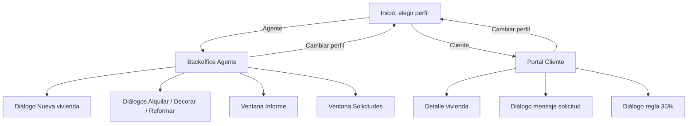
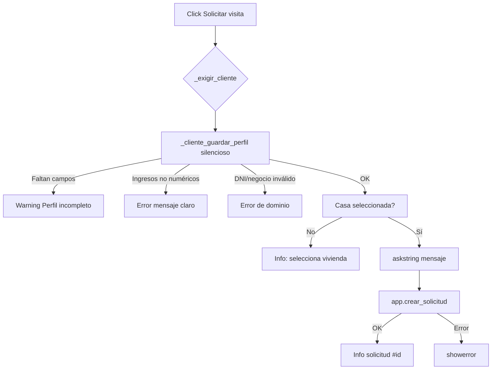

# Documentación de la interfaz de usuario (UI)

## 1. Tecnología y archivo

| Aspecto | Detalle |
|---|---|
| Framework | `tkinter` + `ttk` |
| Clase principal | `AppGrafica` (`src/ui/app_grafica.py`) |
| Ventana | 1040×680 (mín. 920×600) |
| Tema ttk | `clam` |
| Persistencia vista | Indirecta vía `AppInmobiliaria` |

## 2. Mapa de pantallas



La navegación **no usa rutas web**: se destruye el contenido de `_contenedor` y se redibuja la pantalla (`_limpiar` + `_mostrar_*`).

---

## 3. Pantalla de inicio

**Método:** `_mostrar_inicio`

| Elemento | Tipo | Función |
|---|---|---|
| Título | `ttk.Label` | “Sistema Inmobiliario POO” |
| Subtítulo | `ttk.Label` | Indica persistencia SQLite |
| Entrar como Agente | `ttk.Button` | `_mostrar_agente` |
| Entrar como Cliente | `ttk.Button` | `_mostrar_cliente` |
| Pie | `ttk.Label` | Ruta del fichero `.db` |

---

## 4. Backoffice Agente

**Método:** `_mostrar_agente`

### Layout

```text
┌──────────────────────────────────────────────────────────┐
│ Backoffice · Agente                    [Cambiar perfil]  │
├─────────────────────────────┬────────────────────────────┤
│ Treeview inventario         │ Acciones                   │
│ id | dirección | … | estado │ Nueva / Reservar / …       │
│                             │ Valor cartera              │
└─────────────────────────────┴────────────────────────────┘
```

- Contenedor: `ttk.Panedwindow` horizontal (tabla 3/5, acciones 2/5).
- Tabla: `ttk.Treeview` con columnas  
  `id, direccion, localidad, precio, m2, hab, estado`.
- `iid` de cada fila = `str(casa.id)` para recuperar la entidad.

### Acciones y handlers

| Botón UI | Handler | Dominio / servicio |
|---|---|---|
| Nueva vivienda | `_agente_nueva` | `Casa(...)` + `app.agregar_casa` |
| Importar datos… | `_agente_importar` | `filedialog.askopenfilename` → `app.importar_casas` |
| Reservar | `_agente_reservar` | `casa.reservar` + `sincronizar` |
| Liberar | `_agente_liberar` | `casa.liberar` + `sincronizar` |
| Comprar (venta) | `_agente_comprar` | `casa.comprar` + `sincronizar` |
| Alquilar… | `_agente_alquilar` | `Inquilino` + `casa.alquilar` |
| Decorar… | `_agente_decorar` | `casa.decorar` |
| Reformar… | `_agente_reformar` | `casa.reformar` |
| Finalizar reforma | `_agente_fin_reforma` | `casa.finalizar_reforma` |
| Ver informe cartera | `_agente_informe` | `gestion.generar_informe_cartera` |
| Solicitudes de clientes | `_agente_solicitudes` | `app.listar_solicitudes` |

### Diálogos

- **Nueva vivienda:** `Toplevel` modal con `StringVar` + validación numérica.
- **Alquilar / costes:** `simpledialog.askstring` / `askfloat`.
- **Informe / solicitudes:** `Toplevel` con `Text` de solo lectura.

---

## 5. Portal Cliente

**Método:** `_mostrar_cliente`

### Secciones (de arriba a abajo)

1. **Cabecera** — título + Cambiar perfil  
2. **Tu perfil** — `LabelFrame` con 4 entradas + Guardar perfil  
3. **Filtros** — localidad, precio min/max, Buscar disponibles  
4. **Tabla** — solo disponibles  
5. **Barra de acciones** — detalle, solicitudes, regla 35 %

### Columnas de la tabla cliente

`id | direccion | localidad | precio | m2 | hab | eur_m2`

### Perfil y validación

`_cliente_guardar_perfil(silencioso=False|True)`:

- Comprueba campos vacíos → aviso **Perfil incompleto** (lista de faltantes).
- Convierte ingresos (`float`, admite coma decimal).
- Crea `Inquilino` (valida DNI, etc.).
- Usado en silencio por `_exigir_cliente` antes de solicitudes.

### Acciones cliente

| Botón | Handler | Notas |
|---|---|---|
| Ver detalle | `_cliente_detalle` | `messagebox` informativo |
| Solicitar visita | `_cliente_solicitud("VISITA")` | Requiere perfil + selección |
| Me interesa comprar | `_cliente_solicitud("COMPRA")` | Idem |
| Me interesa alquilar | `_cliente_solicitud("ALQUILER")` | Idem |
| Comprobar regla 35% | `_cliente_elegibilidad` | No exige casa seleccionada |

---

## 6. Flujo UI · Solicitar visita (corregido)



---

## 7. Sistema visual

Definido en `COLORES`:

| Token | Hex | Uso |
|---|---|---|
| `fondo` | `#F4F7F5` | Fondo ventana |
| `panel` | `#FFFFFF` | Paneles laterales |
| `primario` | `#0F3D3E` | Títulos (verde petróleo) |
| `acento` | `#C45C26` | Reserva de acento |
| `texto` | `#1C2B2B` | Texto general |
| `suave` | `#D9E5E2` | Superficies suaves |
| `exito` | `#2F6F4E` | Éxito / estados positivos |

Tipografías: **Segoe UI** / **Segoe UI Semibold** (Windows). Estilos ttk: `Titulo.TLabel`, `Sub.TLabel`, `Primario.TButton`, `Tool.TButton`.

Criterio de diseño: look profesional inmobiliario (no tema “dashboard púrpura”); una composición clara por pantalla; la tabla es el ancla de interacción.

---

## 8. Mensajes al usuario

| Tipo | API | Cuándo |
|---|---|---|
| Info | `messagebox.showinfo` | Éxito, detalle, confirmaciones |
| Aviso | `messagebox.showwarning` | Perfil incompleto, no disponible |
| Error | `messagebox.showerror` | Validación / dominio |
| Entrada | `simpledialog.*` | Renta, costes, mensaje |

UTF-8: la demo de consola reconfigura stdout; la UI tkinter usa el encoding del sistema de ventanas.

---

## 9. Ciclo de vida de la ventana

1. `__init__` crea `AppInmobiliaria`, estilos y contenedor.
2. `protocol("WM_DELETE_WINDOW", _al_cerrar)` asegura `app.cerrar()` (cierra SQLite).
3. Cada cambio de pantalla destruye widgets hijos del contenedor.
4. `_refrescar_tabla_*` llama a `app.cargar()` para leer el estado persistido.

---

## 10. Extender la UI

Para añadir un botón en Agente:

1. Añade tupla `(texto, handler)` en la lista `acciones` de `_mostrar_agente`.
2. Implementa `def _agente_mi_accion(self)`.
3. Obtén casa con `_casa_seleccionada_agente()`.
4. Llama al dominio y `self.app.sincronizar(casa)`.
5. `self._refrescar_tabla_agente()`.

Para una nueva pantalla completa: crea `_mostrar_xyz` siguiendo el patrón de inicio/agente/cliente.
