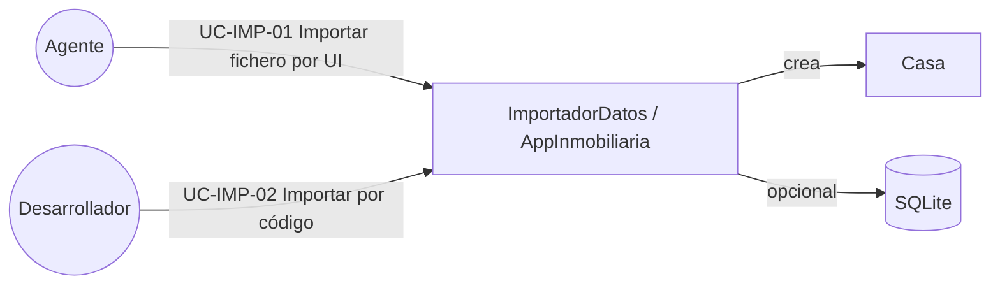
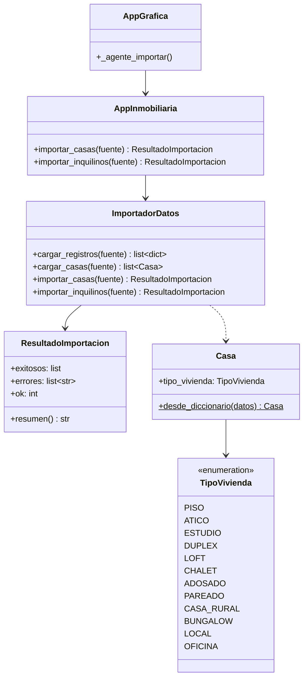
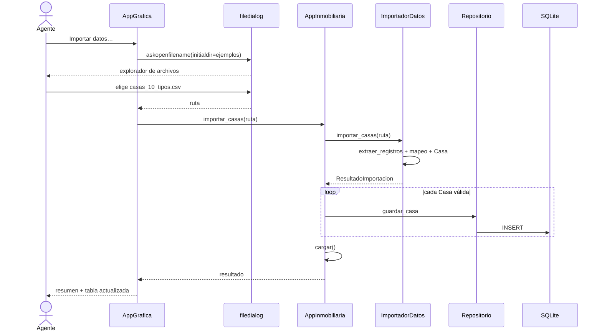
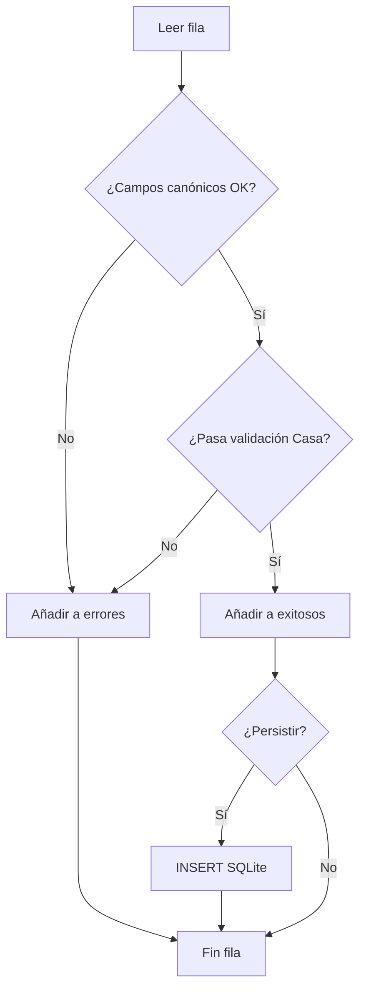

# Importación de datos

Documento de **requisitos**, **casos de uso**, **manuales**, **UML** y explicación de **cómo se realiza la importación** de viviendas (y clientes) hacia las clases del dominio.

---

## 1. Requisitos

### 1.1 Objetivo

Permitir cargar inventarios desde ficheros o estructuras en memoria y convertirlos en instancias de `Casa` / `Inquilino`, con opción de persistirlos en SQLite.

### 1.2 Requisitos funcionales

| ID | Requisito |
|---|---|
| RF-IMP-01 | El sistema debe aceptar CSV, TXT/TSV, JSON y Excel (`.xlsx`) |
| RF-IMP-02 | El sistema debe aceptar `dict`, `list[dict]`, tablas `[cabeceras, filas…]` y DataFrame (pandas) |
| RF-IMP-03 | Debe mapear alias de columnas (`cp`, `m2`, `address`, `tipo`…) a campos canónicos |
| RF-IMP-04 | Debe crear objetos `Casa` / `Inquilino` con las mismas validaciones que el alta manual |
| RF-IMP-05 | Debe soportar tipologías de vivienda (`TipoVivienda`) |
| RF-IMP-06 | Las filas inválidas no deben tumbar toda la carga (modo tolerante por defecto) |
| RF-IMP-07 | El agente debe poder **navegar al fichero** con un diálogo del sistema |
| RF-IMP-08 | Tras importar, las viviendas válidas deben guardarse en SQLite y verse en la tabla |
| RF-IMP-09 | Debe existir un CSV de prueba con al menos 10 inmuebles de tipos distintos |

### 1.3 Requisitos no funcionales

| ID | Requisito |
|---|---|
| RNF-IMP-01 | CSV/TXT/JSON usan solo biblioteca estándar |
| RNF-IMP-02 | Excel requiere dependencia opcional `openpyxl` |
| RNF-IMP-03 | La capa de importación no conoce tkinter (separación UI/dominio) |
| RNF-IMP-04 | Codificación de ficheros de texto: UTF-8 (con BOM opcional) |

### 1.4 Tipos de vivienda admitidos (`TipoVivienda`)

`PISO`, `ATICO`, `ESTUDIO`, `DUPLEX`, `LOFT`, `CHALET`, `ADOSADO`, `PAREADO`, `CASA_RURAL`, `BUNGALOW`, `LOCAL`, `OFICINA`

### 1.5 Columnas canónicas de vivienda

| Campo | Obligatorio | Ejemplo |
|---|---|---|
| `direccion` | Sí | Calle Alcalá 120 3ºB |
| `codigo_postal` | Sí | 28009 |
| `metros_cuadrados` | Sí | 78 |
| `precio` | Sí | 295000 |
| `habitaciones` | Sí | 3 |
| `localidad` | No | Madrid |
| `estado` | No | DISPONIBLE |
| `tipo_vivienda` | No | PISO (por defecto) |

---

## 2. Casos de uso de importación



### UC-IMP-01 · Importar fichero desde la UI (Agente)

| Campo | Detalle |
|---|---|
| **Actor** | Agente |
| **Precondición** | App abierta en perfil Agente |
| **Flujo principal** | 1. Pulsar **Importar datos…**<br>2. Se abre el explorador de archivos (`filedialog`)<br>3. Navegar hasta el fichero (p. ej. `data/ejemplos/casas_10_tipos.csv`)<br>4. Confirmar selección<br>5. El sistema importa, persiste y refresca la tabla<br>6. Se muestra el resumen (OK / errores) |
| **Postcondición** | Viviendas válidas en cartera y en SQLite |
| **Alternativas** | Cancelar diálogo → no hay cambios. Fila inválida → se omite y se lista el error |

### UC-IMP-02 · Importar desde código (desarrollador)

```python
from src.servicios.app_inmobiliaria import AppInmobiliaria

app = AppInmobiliaria()
resultado = app.importar_casas("data/ejemplos/casas_10_tipos.csv")
print(resultado.resumen())
```

### UC-IMP-03 · Importar desde estructura en memoria

```python
from src.importacion import ImportadorDatos

casas = ImportadorDatos().cargar_casas([
    {"direccion": "Calle X", "codigo_postal": "28001", "m2": 50,
     "precio": 150000, "habitaciones": 2, "tipo": "ESTUDIO"},
])
```

---

## 3. Cómo se realiza la importación (flujo técnico)

### 3.1 Pipeline

```text
1) Fuente
   · Ruta de fichero  |  dict / list  |  DataFrame  |  tabla
           │
           ▼
2) extraer_registros()          (src/importacion/fuentes.py)
   · CSV/TXT → csv.DictReader (autodetecta ; , | tab)
   · JSON    → json.loads
   · Excel   → openpyxl (opcional)
   · dict/list/DataFrame → list[dict]
           │
           ▼
3) normalizar_registro()        (src/importacion/mapeo.py)
   · Alias → campos canónicos (cp→codigo_postal, tipo→tipo_vivienda…)
           │
           ▼
4) registro_a_casa()
   · Coerción numérica
   · Casa.desde_diccionario(...)  ← validaciones de dominio
           │
           ▼
5) AppInmobiliaria.importar_casas()
   · casa.id = None
   · agregar_casa() → SQLite
   · cargar() y refresco UI
```

### 3.2 Navegación al fichero en la UI

El botón **Importar datos…** llama a `_agente_importar`:

1. `filedialog.askopenfilename(...)` abre el diálogo nativo del SO.
2. `initialdir` apunta a `data/ejemplos/` para encontrar el CSV de prueba al instante.
3. Filtros: `*.csv`, `*.txt;*.tsv`, `*.json`, `*.xlsx;*.xlsm`, `*.*`.
4. La ruta elegida se pasa a `app.importar_casas(ruta)`.

**No hace falta escribir la ruta a mano**: se navega con el explorador.

### 3.3 Clases involucradas

| Clase | Responsabilidad |
|---|---|
| `ImportadorDatos` | Orquesta carga + conversión + errores por fila |
| `extraer_registros` | Adapta cualquier fuente a `list[dict]` |
| `registro_a_casa` | Mapea y construye `Casa` |
| `AppInmobiliaria` | Persiste y recarga cartera |
| `AppGrafica._agente_importar` | Diálogo de fichero + feedback |

---

## 4. Diagramas UML

### 4.1 Clases (importación)



### 4.2 Secuencia — importar CSV desde UI



### 4.3 Actividad — decisión por fila



---

## 5. Manual de usuario (importación)

### 5.1 Importar el CSV de prueba (12 tipologías)

1. Ejecuta `python main.py`
2. Entra como **Agente**
3. Pulsa **Importar datos…**
4. En el explorador, ve a la carpeta del proyecto → `data` → `ejemplos`
5. Selecciona **`casas_10_tipos.csv`**
6. Acepta: verás el resumen y las filas nuevas en la tabla (columna **Tipo**)

### 5.2 Formato del CSV

- Separador recomendado: **`;`**
- Primera fila: cabeceras
- `tipo_vivienda` en mayúsculas según el enum
- UTF-8

Fichero de prueba incluido:

`data/ejemplos/casas_10_tipos.csv` — **12 viviendas**, una por tipología (PISO, ATICO, ESTUDIO, DUPLEX, LOFT, CHALET, ADOSADO, PAREADO, CASA_RURAL, BUNGALOW, LOCAL, OFICINA).

### 5.3 Si una fila falla

La importación continúa. El resumen indica qué fila falló (CP inválido, tipo desconocido, etc.).

### 5.4 Excel

Instala `pip install openpyxl` y elige un `.xlsx` en el mismo diálogo.

---

## 6. Manual del desarrollador (importación)

### 6.1 Módulos

| Archivo | Rol |
|---|---|
| `src/importacion/fuentes.py` | Adaptadores de entrada |
| `src/importacion/mapeo.py` | Alias + factory a modelos |
| `src/importacion/importador.py` | API pública + `ResultadoImportacion` |
| `src/servicios/app_inmobiliaria.py` | Persistencia tras importar |
| `src/ui/app_grafica.py` | `filedialog` + botón Agente |

### 6.2 Extender un alias

En `mapeo.py`, añade a `_ALIAS_CASA`:

```python
"mi_columna": "direccion",
```

### 6.3 Extender un tipo de vivienda

1. Añadir valor en `TipoVivienda` (`constantes.py`)
2. Usarlo en el CSV
3. No hace falta migrar más si ya existe columna `tipo_vivienda`

### 6.4 Tests

```bash
python -m unittest tests.test_importacion -v
```

### 6.5 Ejemplo programático completo

```python
from src.importacion import ImportadorDatos
from src.servicios.app_inmobiliaria import AppInmobiliaria

# Sin BD
casas = ImportadorDatos().cargar_casas("data/ejemplos/casas_10_tipos.csv")
assert len(casas) == 12

# Con BD
app = AppInmobiliaria("data/prueba_import.db")
r = app.importar_casas("data/ejemplos/casas_10_tipos.csv")
print(r.resumen())
app.cerrar()
```

---

## 7. Otros ficheros de ejemplo

| Archivo | Contenido |
|---|---|
| `data/ejemplos/casas_10_tipos.csv` | **12 tipologías** (usar en la demo) |
| `data/ejemplos/casas.csv` | 3 viviendas básicas |
| `data/ejemplos/casas.txt` | TXT con delimitador `\|` |
| `data/ejemplos/casas.json` | JSON con alias en inglés |
